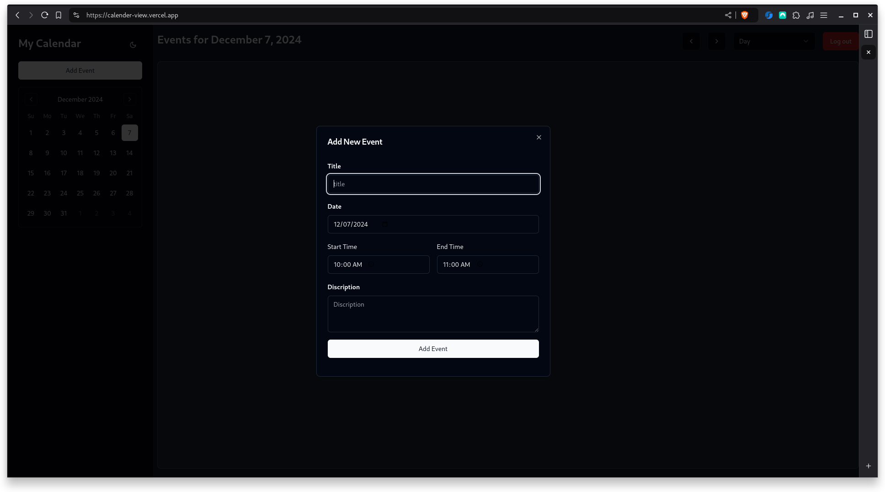

# Calendar

This project is a simple calendar feature application that allows users to create, view, edit, and delete events on their personal calendar. The solution consists of a frontend built with React and a backend built with Express.js. The application includes Firebase authentication and CRUD operations for calendar events.


## Features

### User Authentication
- Firebase Authentication is used for secure user login and registration.
- Users can log in to manage their calendar events.
- Authentication ensures that users can only access their own data.


### Calendar Features
- **Create Events**: Users can create events with details such as Title, Date & Time, and Description.
- **View Events**: A list or calendar view displays all events created by the user.
- **Edit Events**: Users can update event details.
- **Delete Events**: Users can delete events they no longer need.


### Backend
- A RESTful API is implemented for handling CRUD operations for calendar events.
- Events are stored in a database (e.g., sqlite).
- Middleware ensures that each user only has access to their events.


### Frontend
- A user-friendly interface for managing events.
- Forms for creating and editing events.
- A responsive design using Shadcn and Tailwind for styling.


### Prerequisites
- Bun installed
- Firebase project configured for authentication


### Installation
1. Clone the repository:
   
```bash
   git clone https://github.com/Prathamdas3/calender
   cd calendar
```

2. Install dependencies for the server:

```bash
    cd server
    bun install
```

3. Install dependencies for the client:
   
```bash
   cd ../client
   bun install
```


## Running the Application

1. Navigate to the server folder:
   
```bash
   cd server
```

2. Create a .env file and add the following:

```txt
DATABASE_URL="file:./dev.db"
```

3. Start the server
```bash
   bun run index.ts
```

1. Start the Frontend:

```bash
cd client
```

2. Create a .env.local file and add the following:

```txt
VITE_API_KEY=
VITE_AUTH_DOMAIN=
VITE_PROJECT_ID=
VITE_STORSGEBUCKET=
VITE_MESSAGING_SENDER_ID=
VITE_APP_ID=
VITE_MEASUREMENTID=
VITE_BASE_URL=
```

3. Start the client

```bash
bun run dev
```

4. Open the app in your browser

```text
http://localhost:3000
```

## API Endpoints


### Authentication
- Authentication is handled by Firebase.

### Events
- `GET /events`: Fetch all events for the authenticated user.
- `POST /event`: Create a new event
- `GET /event/:id`: Fetch an event
- `PATCH /event/:id`: Update an event
- `DELETE /event/:id`: Delete an event

### Technologies Used
- **Frontend**: React, Tailwind, Vite
- **Backend**: Express.js, Sqlite, Prisma
- **Authentication**: Firebase Authentication
- **Styling**: Tailwind, Shadcn

### Project Images
<div style="display:grid,grid-cols:3">





</div>


### License
This project is open-source and available under the MIT License.

Feel free to contribute or provide feedback!